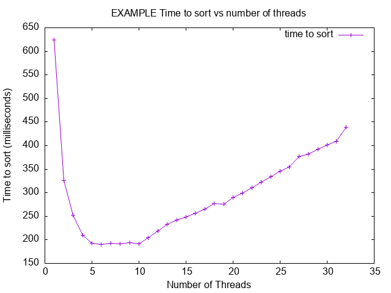

# Project 3 - Multithreaded Sorting Application

- Name: Benjamin Blodgett
- Email: benjaminblodgett311@u.boisestate.edu
- Class: 452-002

## Known Bugs or Issues

TODO: Are there any known issues?

## Experience

TODO: Describe your experience with the project (struggles, breakthroughs, etc.).

## Analysis

TODO: Provide your analysis of the results. If the assignment does not require analysis, you can remove this section.

Here is an example of how to include a plot in your README:

