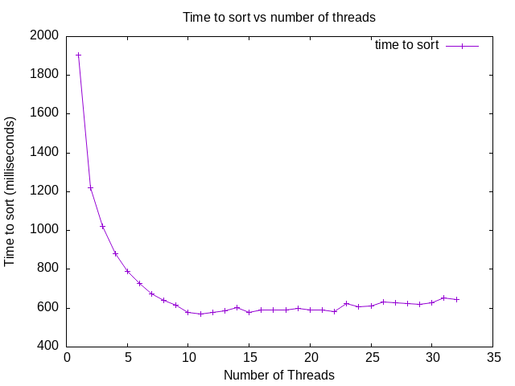

# Submission Report

- Submission generated at 10/27/2025 at 05:45:19

- Machine info: Linux runnervmwhb2z 6.11.0-1018-azure #18~24.04.1-Ubuntu SMP Sat Jun 28 04:46:03 UTC 2025 x86_64 x86_64 x86_64 GNU/Linux

## Note to Students

Please read this report carefully before submission.
Ensure that all sections are complete and accurate.
Look for any errors in the build or test outputs.
If you find any issues, correct them before submitting.
Post any questions on the class discussion board for help.


---

## README

# Project 3 - Multithreaded Sorting Application

- Name: Benjamin Blodgett
- Email: benjaminblodgett311@u.boisestate.edu
- Class: 452-002

## Known Bugs or Issues

``make test`` will cry that there are two entry points. The makefile doesn't expect us to write a main.c *and* a test_sort.c but the point of this project is to write a standalone program to generate a graph, so I guess that the testing suite is just for giggles? ChatGPT wrote all of it anyways.

## Experience

This project was neat. AI helped me work out a lot of the implementation, but I worked on most of the ``mergesort_mt`` function myself based on in-class discussions. I like this solution because it splits the workload evenly and allows us to join in a simple way as well as assign work in a very straightforward way.

## Analysis

I believe my laptop has more cores available to the programmer than Onyx, so it didn't hit the marginal utility part of the graph until around 16 threads. This is because running ``nproc`` on my system yields 16 cores. The graph eventually hits diminishing returns. After 16 threads it hits *negative* returns also. I think what I was able to generate was actually a little smoother than the example. At a certain point the program doesn't benefit from more threads. The optimum number of threads is kinda arbitrary and depends on the opportunity cost function for using additional threads, however the program ran fastest with 11 threads. The slowest number of threads was 1 thread on my machine. Trying to use the full 16 threads is difficult because I have a lot of stuff running that likely uses some of my other threads.

This is the part of my analysis where I talk more about my project because I need to fulfill a word count requirement. I think I could have seen something a little more similar to the example graph on Onyx if the graph range went up to 64 threads, because that's about double the current and my laptop graph bottomed out at 10 whereas the example bottomed out at 5. I was surprised how consistent my graph was but also how slowly it approached diminishing returns compared to the Onyx graph. It really shows that there are many cases where spinning up a dozen or so threads might be beneficial for some machines rather than just spinning up 2 or 4 threads.

Also something I realize is that ``nproc`` reports logical CPUs not physical cores. So I don't know what effect that has. I suppose there is a way to query in C for core count and spin up a corresponding amount of threads, but that was also somewhat discouraged against in class. I would like to try this threading approach with my Minecraft-clone project. It was very expensive to generate new world geometry when loading in new chunks and whenever the player did so it would cause one huge stutter. Multithreading is essentially mandatory for resolving this issue from what I understand from other people's videos. In my case I might try to spin up a thread for every chunk. There were other issues with my implementation that might make the stutters less powerful but that's beside the point.

I might be losing out on performance and thereby influencing the graph because of my naive joining solution. I really don't want to figure out how to merge blocks as they are joined though. I assume it might not make a big difference because the blocks all provide a relatively equal workload to each thread. However, we can't assume that the threads will take a similar amount of time to finish even if their workload is hypothetically similar. I wonder if there is a way to partition work in a fancy way so that when threads finish early we can estimate how early they are and give them additional work accordingly.



---


## Build Output

This section was generated by running `make all` in the project root directory.

```bash
make[1]: Entering directory '/home/runner/work/cs452-p3/cs452-p3'
mkdir -p build/debug
cc -g -O0 -DDEBUG -fno-omit-frame-pointer -fsanitize=address -c src/lab.c -o build/debug/lab.c.o
src/lab.c:3:10: fatal error: plibsys.h: No such file or directory
    3 | #include <plibsys.h>
      |          ^~~~~~~~~~~
compilation terminated.
make[1]: *** [Makefile:64: build/debug/lab.c.o] Error 1
make[1]: Leaving directory '/home/runner/work/cs452-p3/cs452-p3'
make[1]: Entering directory '/home/runner/work/cs452-p3/cs452-p3'
mkdir -p build/release
cc -Wall -Wextra -O2 -fPIE -MMD -MP -Wformat -Wformat=2 -Wconversion -Wsign-conversion -Wimplicit-fallthrough -fstack-protector-strong -Werror=format-security -Werror=implicit -Werror=incompatible-pointer-types -Werror=int-conversion -c src/lab.c -o build/release/lab.c.o
src/lab.c:3:10: fatal error: plibsys.h: No such file or directory
    3 | #include <plibsys.h>
      |          ^~~~~~~~~~~
compilation terminated.
make[1]: *** [Makefile:64: build/release/lab.c.o] Error 1
make[1]: Leaving directory '/home/runner/work/cs452-p3/cs452-p3'
make[1]: Entering directory '/home/runner/work/cs452-p3/cs452-p3'
mkdir -p build/tests
cc -g -O0 -DTEST -fprofile-arcs -ftest-coverage -c src/lab.c -o build/tests/lab.c.o
src/lab.c:3:10: fatal error: plibsys.h: No such file or directory
    3 | #include <plibsys.h>
      |          ^~~~~~~~~~~
compilation terminated.
make[1]: *** [Makefile:64: build/tests/lab.c.o] Error 1
make[1]: Leaving directory '/home/runner/work/cs452-p3/cs452-p3'
make[1]: Entering directory '/home/runner/work/cs452-p3/cs452-p3'
mkdir -p build/debug-test
cc -g -O0 -DDEBUG -DTEST -fno-omit-frame-pointer -fsanitize=address -c src/lab.c -o build/debug-test/lab.c.o
src/lab.c:3:10: fatal error: plibsys.h: No such file or directory
    3 | #include <plibsys.h>
      |          ^~~~~~~~~~~
compilation terminated.
make[1]: *** [Makefile:64: build/debug-test/lab.c.o] Error 1
make[1]: Leaving directory '/home/runner/work/cs452-p3/cs452-p3'
Builds completed. You can run the application with: ./build/release/myapp
You can run the debug build with: ./build/debug/myapp_d
You can run the test build with: ./build/tests/myapp_t
You can run the debug-test build with: ./build/debug-test/myapp_td
```

---

## Coverage Report

This section was generated by running `make report` in the project root directory.

```bash
Build the debug target first by running 'make test'.
make: *** [Makefile:134: report] Error 1
```

---

## Address Sanitizer Report

This section was generated by running `make leak-test` in the project root directory.

```bash
Build the debug target first by running 'make debug-test'.
make: *** [Makefile:117: leak-test] Error 1
```

---

## Src Files
### lab.c

```c

#include <stdlib.h>
#include <sys/time.h> /* for gettimeofday system call */
#include <plibsys.h>
#include "lab.h"

/**
 * @brief Standard insertion sort that is faster than merge sort for small array's
 *
 * @param A The array to sort
 * @param p The starting index
 * @param r The ending index
 */
static void insertion_sort(int A[], int p, int r)
{
  int j;

  for (j = p + 1; j <= r; j++)
    {
      int key = A[j];
      int i = j - 1;
      while ((i > p - 1) && (A[i] > key))
        {
	  A[i + 1] = A[i];
	  i--;
        }
      A[i + 1] = key;
    }
}


void mergesort_s(int A[], int p, int r)
{
  if (r - p + 1 <=  INSERTION_SORT_THRESHOLD)
    {
      insertion_sort(A, p, r);
    }
  else
    {
      int q = (p + r) / 2;
      mergesort_s(A, p, q);
      mergesort_s(A, q + 1, r);
      merge_s(A, p, q, r);
    }

}

void merge_s(int A[], int p, int q, int r)
{
  int *B = (int *)malloc(sizeof(int) * (r - p + 1));

  int i = p;
  int j = q + 1;
  int k = 0;
  int l;

  /* as long as both lists have unexamined elements */
  /*  this loop keeps executing. */
  while ((i <= q) && (j <= r))
    {
      if (A[i] < A[j])
        {
	  B[k] = A[i];
	  i++;
        }
      else
        {
	  B[k] = A[j];
	  j++;
        }
      k++;
    }

  /* now only at most one list has unprocessed elements. */
  if (i <= q)
    {
      /* copy remaining elements from the first list */
      for (l = i; l <= q; l++)
        {
	  B[k] = A[l];
	  k++;
        }
    }
  else
    {
      /* copy remaining elements from the second list */
      for (l = j; l <= r; l++)
        {
	  B[k] = A[l];
	  k++;
        }
    }

  /* copy merged output from array B back to array A */
  k = 0;
  for (l = p; l <= r; l++)
    {
      A[l] = B[k];
      k++;
    }

  free(B);
}

double getMilliSeconds()
{
  struct timeval now;
  gettimeofday(&now, (struct timezone *)0);
  return (double)now.tv_sec * 1000.0 + now.tv_usec / 1000.0;
}


/**
 * Breaks array into num_thread blocks and sorts each block with a thread.
 * AI Use: Assisted By AI
 */
void mergesort_mt(int *A, int n, int num_thread)
{
  const int block_offset = n / num_thread;
  parallel_args args[num_thread];
  pthread_t threads[num_thread];

  for (int i = 0; i < num_thread; i++)
  {
    args[i].A = A;
    args[i].start = i * block_offset;
    args[i].end = (i + 1) * block_offset;
    if (i == num_thread - 1)
      args[num_thread - 1].end += n % block_offset;

    if (pthread_create(&threads[i], NULL, parallel_mergesort, &args[i]))
      perror("pthread_create");
  }

  for (int i = 0; i < num_thread; i++)
    pthread_join(threads[i], NULL);

  if (num_thread < 2)
    return;

  int runs = num_thread;
  while (runs > 1) {
      int next = 0;
      for (int i = 0; i + 1 < runs; i += 2) {
          int p = args[i].start;
          int q = args[i].end - 1;
          int r = args[i + 1].end - 1;

          merge_s(A, p, q, r);

          args[next].start = p;
          args[next].end = r + 1;
          next++;
      }

      if (runs % 2 == 1) {
          args[next++] = args[runs - 1];
      }

      runs = next;
  }
}

/**
 * Calls mergesort_s with given void* args
 * AI Use: Written By AI
 */
void *parallel_mergesort(void *args)
{
  parallel_args *arg = (parallel_args *)args;
  mergesort_s(arg->A, arg->start, arg->end - 1);
  return NULL;
}


```

### lab.h

```c

#ifndef LAB_H
#define LAB_H
#include <pthread.h>

#ifdef __cplusplus
extern "C"
{
#endif

  // The threshold that we will use to switch to insertion sort, make sure that
  // you use test arrays bigger than 5 so you are testing the merge sort
#define INSERTION_SORT_THRESHOLD 2
#define MAX_THREADS 32
  /**
   * @brief Sorts an array of ints into ascending order using the constant
   * INSERTION_SORT_THRESHOLD internally
   *
   * @param A A pointer to the start of the array
   * @param p The starting index
   * @param r The ending index
   */
  void mergesort_s(int *A, int p, int r);

  /**
   * @brief Merge two sorted sequences A[p..q] and A[q+1..r] and place merged
   *              output back in array A. Uses extra space proportional to
   *              A[p..r].
   *
   * @param A The array to merge into
   * @param p The starting index of the first half
   * @param q The middle
   * @param r The ending index of the second half
   */
  void merge_s(int A[], int p, int q, int r);

  /**
   * @brief Sorts an array of ints into ascending order using multiple
   * threads
   *
   * @param A A pointer to the start of the array
   * @param n The size of the array
   * @param num_threads The number of threads to use.
   */
  void mergesort_mt(int *A, int n, int num_thread);

  /**
   * @brief retuns the current time as milliseconds
   * @return the number of milliseconds
   */
  double getMilliSeconds();

  /**
   * @brief Represents a chunk of the array to be sorted by a thread
   *
   */
  typedef struct parallel_args
  {
    int *A;
    int start;
    int end;
    pthread_t tid;
  } parallel_args;

  /**
   * @brief The function that is called by each thread to sort their chunk
   *
   * @param args see struct parallel_args
   * @return void* always NULL
   */
  void *parallel_mergesort(void *args);

  /**
   * @brief Entry point for the main function
   *
   * @param argc The argument count
   * @param argv The argument array
   * @return The exit code
   */
  int myMain(int argc, char **argv);

#ifdef __cplusplus
} // extern "C"
#endif

#endif

```

### main.c

```c

#include <stdio.h>
#include <stdlib.h>
#include <time.h>
#include "lab.h"

/**
 * Fills an array with random integers.
 *
 * AI Use: Written By AI
 */
static void fill_rand(int *a, int n)
{
    for (int i = 0; i < n; i++) a[i] = rand();
}

/**
 * Takes an array size and thread count and sorts a random array of
 * that size with the specified amount of threads.
 *
 * AI Use: Written By AI
 */
int main(int argc, char **argv)
{
    if (argc < 3) {
        printf("usage: %s <array_size> <num_threads>\n", argv[0]);
        return 1;
    }

    int n = atoi(argv[1]);
    int t = atoi(argv[2]);
    if (n < 0) n = 0;
    if (t < 1) t = 1;
    if (t > MAX_THREADS) t = MAX_THREADS;

    int *A = n ? (int*)malloc((size_t)n * sizeof(int)) : NULL;
    if (n && !A) return 2;

    srand((unsigned)time(NULL));
    if (n) fill_rand(A, n);

    double start = getMilliSeconds();
    mergesort_mt(A, n, t);
    double end = getMilliSeconds();

    printf("%d %f\n", t, end - start);

    free(A);
    return 0;
}


```

## Tests Files
### test_sort.c

```c

#include <stdlib.h>
#include <string.h>
#include <limits.h>
#include "harness/unity.h"
#include "../src/lab.h"

static int is_sorted(const int *a, int n)
{
    for (int i = 1; i < n; i++) if (a[i-1] > a[i]) return 0;
    return 1;
}

static void fill_seq(int *a, int n) { for (int i = 0; i < n; i++) a[i] = i; }
static void fill_rev(int *a, int n) { for (int i = 0; i < n; i++) a[i] = n - 1 - i; }
static void fill_const(int *a, int n, int v) { for (int i = 0; i < n; i++) a[i] = v; }
static void fill_small_domain(int *a, int n, int k) { for (int i = 0; i < n; i++) a[i] = i % k; }
static void fill_extremes(int *a, int n)
{
    for (int i = 0; i < n; i++) a[i] =
        (i % 4 == 0) ? INT_MIN : (i % 4 == 1) ? INT_MAX : (i % 4 == 2) ? -i : i;
}

void setUp(void) {}
void tearDown(void) {}

static void check_sorted_eqref(int *a, int n)
{
    int *ref = n ? malloc((size_t)n * sizeof(int)) : NULL;
    if (n) memcpy(ref, a, (size_t)n * sizeof(int));
    mergesort_s(ref, 0, n ? n - 1 : 0);
    TEST_ASSERT_TRUE(is_sorted(a, n));
    TEST_ASSERT_EQUAL_INT_ARRAY(ref, a, n);
    free(ref);
}

static void run_mt_case(int n, int threads, void (*fill)(int*,int))
{
    int *a = n ? malloc((size_t)n * sizeof(int)) : NULL;
    if (n) fill(a, n);
    mergesort_mt(a, n, threads);
    check_sorted_eqref(a, n);
    free(a);
}

void test_s_empty(void) { int *a = NULL; mergesort_s(a, 0, -1); TEST_ASSERT_TRUE(1); }
void test_s_single(void) { int a[1] = {42}; mergesort_s(a, 0, 0); TEST_ASSERT_TRUE(is_sorted(a,1)); }
void test_s_small_threshold_edges(void) { int a[3] = {2,1,2}; mergesort_s(a,0,2); TEST_ASSERT_TRUE(is_sorted(a,3)); }

void test_merge_basic(void)
{
    int a[10];
    for (int i=0;i<5;i++) a[i]=i*2;
    for (int i=0;i<5;i++) a[5+i]=i*2+1;
    merge_s(a,0,4,9);
    TEST_ASSERT_TRUE(is_sorted(a,10));
}

void test_merge_uneven(void)
{
    int a[11];
    for (int i=0;i<7;i++) a[i]=i*3;
    for (int i=0;i<4;i++) a[7+i]=i*3+1;
    merge_s(a,0,6,10);
    TEST_ASSERT_TRUE(is_sorted(a,11));
}

void test_mt_n0_t_any(void) { run_mt_case(0, 8, fill_seq); }
void test_mt_n1(void) { run_mt_case(1, 8, fill_seq); }
void test_mt_t1(void) { run_mt_case(1000, 1, fill_rev); }
void test_mt_t_eq_n_cap(void) { run_mt_case(32, 64, fill_rev); }
void test_mt_t_gt_n(void) { run_mt_case(16, 128, fill_extremes); }
void test_mt_rev_large(void) { run_mt_case(5000, 8, fill_rev); }
void test_mt_const(void) { run_mt_case(4096, 6, (void(*)(int*,int)) (void*) (fill_const)), (void)0; }

void test_mt_small_domain(void) { run_mt_case(7000, 7, (void(*)(int*,int)) (void*) (fill_small_domain)); }
void test_mt_extremes(void) { run_mt_case(6000, 5, fill_extremes); }

int main(void)
{
    UNITY_BEGIN();
    RUN_TEST(test_s_empty);
    RUN_TEST(test_s_single);
    RUN_TEST(test_s_small_threshold_edges);
    RUN_TEST(test_merge_basic);
    RUN_TEST(test_merge_uneven);
    RUN_TEST(test_mt_n0_t_any);
    RUN_TEST(test_mt_n1);
    RUN_TEST(test_mt_t1);
    RUN_TEST(test_mt_t_eq_n_cap);
    RUN_TEST(test_mt_t_gt_n);
    RUN_TEST(test_mt_rev_large);
    RUN_TEST(test_mt_const);
    RUN_TEST(test_mt_small_domain);
    RUN_TEST(test_mt_extremes);
    return UNITY_END();
}


```

## Scripts Files
### createplot.sh

```c

#!/usr/bin/env bash
#NOTE!!! THIS needs to be in the scripts directory!!!
function usage() {
    echo "$0 usage:" && grep " .)\ #" $0
    exit 0
}
[ $# -eq 0 ] && usage
while getopts "hs:f:" arg; do
    case $arg in
    s) # The size of the array to sort.
        size=${OPTARG}
        ;;
    f) # The plot file name
        name=${OPTARG}
        ;;
    h | *) # Display help.
        usage
        exit 0
        ;;
    esac
done
MYAPP="../build/release/myapp"

if [ "$name" == "" ] || [ "$size" == "" ]
then
        usage
        exit 0
fi
if [ -e $MYAPP ]; then
    if [ -e "data.dat" ]; then
        rm -f data.dat
    fi
    echo "Running myprogram to generate data"
    echo "#Time Threads" >> data.dat
    for n in {1..32}; do
        echo -ne "running $n thread \r"
        $MYAPP "$size" "$n" >> data.dat
    done
    gnuplot -e "filename='$name.png'" graph.plt
    echo "Created plot $name.png from data.dat file"
else
    echo "myapp is not present in the build directory. Did you compile your code?"
fi

```

Report generated on 10/27/2025 at 05:45:19


---

## End of Report

SHA-256 Hash of the report: 096dbefebda4482dbe3f7e2d3b19455a2c5696a5806b37be4ff8ab5630585482

Do not edit the generated report. Any changes will be reported as academic dishonesty

---
## GitHub Info
- GitHub repo name: benjaminblodgett311/cs452-p3
- The repository visibility is public.
- The workflow was triggered by benjaminblodgett311
